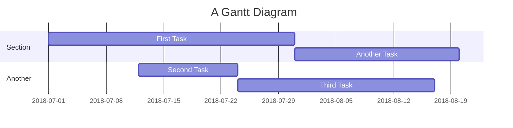

# BETA TEST

## OBIETTIVI

Testare il gioco, segnalar eeventuali bug, consigli e spunti sull'user experience
- Eccezioni del try-catch
prova bene tutte le eccezioni possibili: numeri troppo grossi, stringhe,ecc

### BUG
Controllare problema che non sono riuscito a risolvere

### NOTE

### USER ECPERIENCE
hai suggerimenti per migliorare l'esperienza utente su questo gioco?
Coma valuti l'usabilità e la chiarezza del gioco?

## POST  BETA TEST:

Raccolta feedback

### Raccolta feedback di Alessandro:
- Eccezioni non gestite
- [x] stringhe
- [] numeri maggiori o minori
- Bug
- []
- Miglioramenti
- [x] explicitare il range di numeri tra i quali indovinare
- [x] Togliere True e False dai messaggi in console

## GRAFICI GANTT

