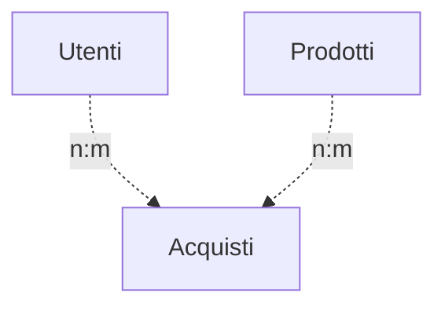
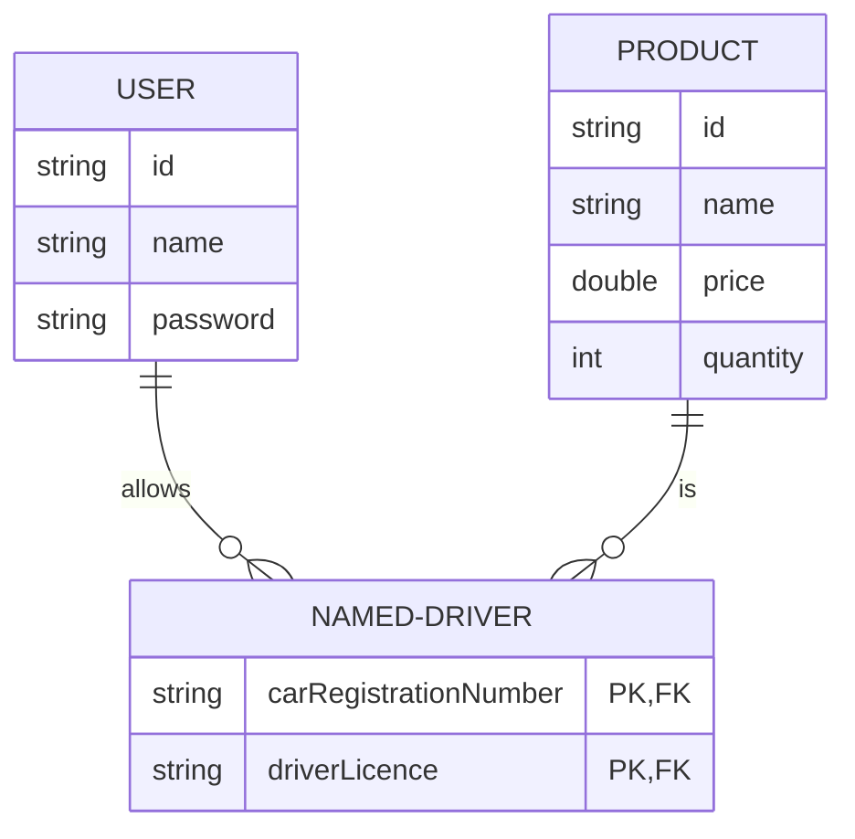

# Progetto dei Json in MVC con Entity Framework in C# 

## Questo progetto è un'applicazione che segue il pattern MVC (Model-View-Controller) utilizzando Entity Framework per il database. L'applicazione consente agli utenti di registrarsi, fare il login e accedere a degli acquisti da poter fare tramite un balance prestabilito. Successivamente gli utenti loggati potranno acceder al proprio storico degli acquisti ed al proprio balance.

# Struttura Progetto

- Model: Contiene la logica di business e la rappresentazione dei dati.

- View: Si occupa della presentazione delle informazioni all'utente tramite console (e della raccolta degli input?).

- Controller: Coordina il flusso di dati tra il modello e la vista, gestendo gli input dell'utente e il controllo del programma. La classe Controller gestisce il menu principale e le azioni degli utenti.

# Struttura Progetto

- il programma inizia con un metodo che verifica l'esistenza del database, e se non esiste lo crea
- Dopodichè richiamo un metodo che 
- Nella classe Controller istanzio le classi database, view, usermodel e user per poterne usare gli attributi, dopodichè ho un metodo MainMenu che viene poi chiamato nella classe Program che contiene tutta la logica del programma.
- In controller, dentro il metodo MainMenu, ho i metodi:
   - UtenteRegistrazione, che serve a chiedere all'utente nome e password per registrarsi all'ipotetico sito.
   Nello specifico dopo aver preso i dati inseriti dall'utente, vado a verificare se non esiste già un utente con quel nome all'interno del database, ed in tal caso con Entity Framework inserisco i dati nel database nella tabella User
   - UtenteLogin, che serve all'utente per effettuare il login e poter accedere agli acquisti.
   - RichiestaAcquisti, serve a chiedere all'utente quali acquisti vuole fare e ad aggiungere al database i dati relativi all' acquisto, ovvero: nome utente, nome prodotto acquistato, prezzo prodotto acquistato.

 - grafico:

Nella relazione "n:m":

- Ogni utente può essere associato a molti acquisti (ad esempio, un utente può fare più acquisti).
- Ogni acquisto può coinvolgere più utenti (ad esempio, un acquisto può essere effettuato da più utenti, come in un ordine condiviso).

- Con pk: primary key e fk: foreign key

```mermaid
graph TD
    subgraph Tabella_Utenti
    ID_Utente(PK) --> Nome
    ID_Utente(PK) --> Password
    end
    subgraph Tabella_Prodotti
    ID_Prodotto(PK) --> Nome
    ID_Prodotto(PK) --> Prezzo
    ID_Prodotto(PK) --> Quantità
    end
    subgraph Tabella_Acquisti
    ID_Acquisto(PK) --> ID_Utente(FK)
    ID_Acquisto(PK) --> ID_Prodotto(FK)
    ID_Acquisto(PK) --> Data
    end
```

# Passaggi pratici

- Creo nel controller il metodo per fare la registrazione dell'utente, che comprenderà il metodo per fare il check se un utente esiste gia nel database e 

- Aggiungere i prodotti acquistati dall'utente dopo che li acquista 

- 
