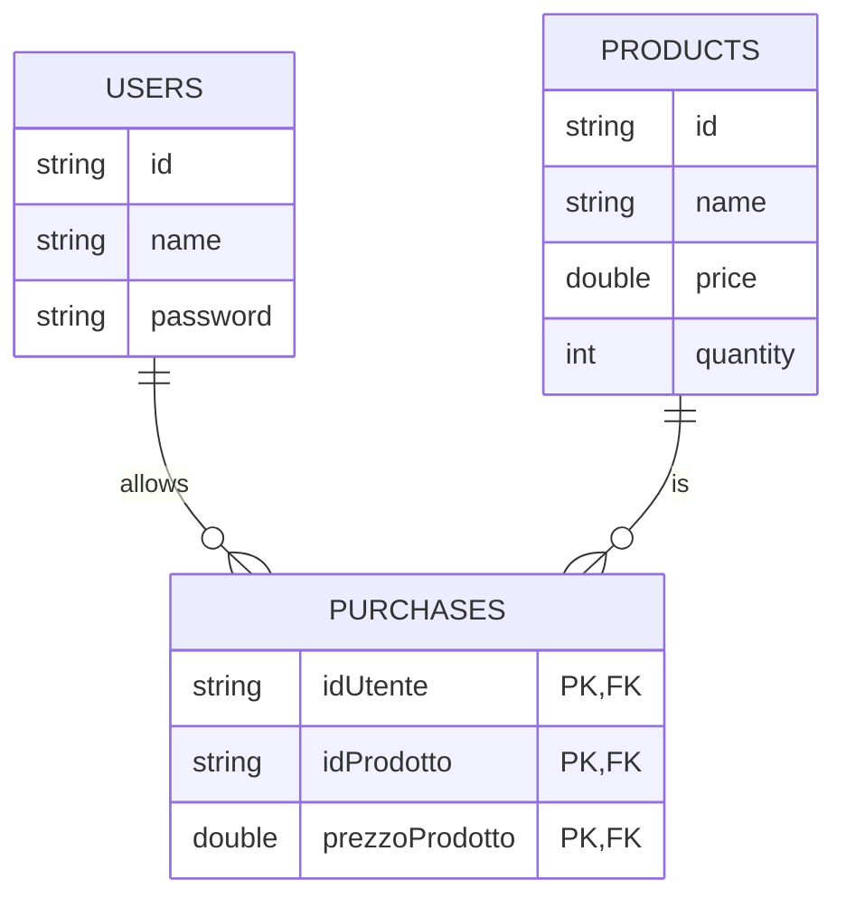
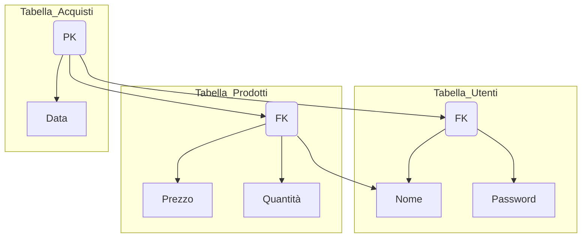

# Progetto dei Json in MVC con Entity Framework in C# 

## Questo progetto è un'applicazione che segue il pattern MVC (Model-View-Controller) utilizzando Entity Framework per il database. L'applicazione consente agli utenti di registrarsi, fare il login e accedere a degli acquisti da poter fare tramite un balance prestabilito. Successivamente gli utenti loggati potranno acceder al proprio storico degli acquisti ed al proprio balance.

# Struttura Progetto

## Model

Il Model contiene la logica di business e la rappresentazione dei dati.

- User: rappresenta gli utenti registrati nel sistema. Ogni utente ha un identificatore unico, un nome utente e una password.
- Product: rappresenta i prodotti disponibili per l'acquisto. Ogni prodotto ha un identificatore unico, un nome, un prezzo e una quantità disponibile.
- Purchase: rappresenta gli acquisti effettuati dagli utenti. Ogni acquisto è associato a un utente, un prodotto e una data di acquisto.

## View

La View si occupa della presentazione delle informazioni all'utente tramite console e della raccolta degli input.

## Controller

Il Controller coordina il flusso di dati tra il modello e la vista, gestendo gli input dell'utente e il controllo del programma. La classe Controller gestisce il menu principale e le azioni degli utenti.

# Struttura Progetto

- il programma inizia con un metodo che verifica l'esistenza del database, e se non esiste lo crea
- Dopodichè richiamo un metodo che 
- Nella classe Controller istanzio le classi database, view, usermodel e user per poterne usare gli attributi, dopodichè ho un metodo MainMenu che viene poi chiamato nella classe Program che contiene tutta la logica del programma.
- Il menu principale (MainMenu) consente all'utente di scegliere tra diverse opzioni, come la registrazione, il login o l'uscita dall'applicazione. Queste opzioni vengono gestite tramite il metodo MainMenu del Controller.
- In controller, dentro il metodo MainMenu, ho i metodi:
   - UtenteRegistrazione, che serve a chiedere all'utente nome e password per registrarsi all'ipotetico sito.
   Nello specifico dopo aver preso i dati inseriti dall'utente, vado a verificare se non esiste già un utente con quel nome all'interno del database, ed in tal caso con Entity Framework inserisco i dati nel database nella tabella User
   - UtenteLogin, che serve all'utente per effettuare il login e poter accedere agli acquisti.
   - RichiestaAcquisti, serve a chiedere all'utente quali acquisti vuole fare e ad aggiungere al database i dati relativi all' acquisto, ovvero: nome utente, nome prodotto acquistato, prezzo prodotto acquistato.
   - VisualizzaStoricoAcquisti: l'utente può visualizzare lo storico degli acquisti effettuati, consultando le informazioni riguardanti i prodotti acquistati.
   - AcquistaAncora: metodo che richiamerà nuovamente la richiesta acquisti
   - Uscita dal programma se clicco il tasto 3 

 - grafico:

Nella relazione "n:m":

- Ogni utente può essere associato a molti acquisti (ad esempio, un utente può fare più acquisti).

- Con pk: primary key e fk: foreign key

# Passaggi pratici

- Creo nel controller il metodo per fare la registrazione dell'utente, che comprenderà il metodo per fare il check se un utente esiste gia nel database e 

- Aggiungere i prodotti acquistati dall'utente dopo che li acquista 

- se un utente non è registrato, si logga, esce la scritta "non sei ancora registrato" ma va avanti con l'acquisto

- fare un opzione per il titolare che consenta di modificare i prodotti, inserirne di nuovi, eliminarli, ecc

- fare che si aggiorna il database quando compro un prodotto

- fare si che gli acquisti vengano fatti in base al balance

- da far vedere il balance dell'utente e il prezzo dei prodotti prima che avvenga l'acquisto